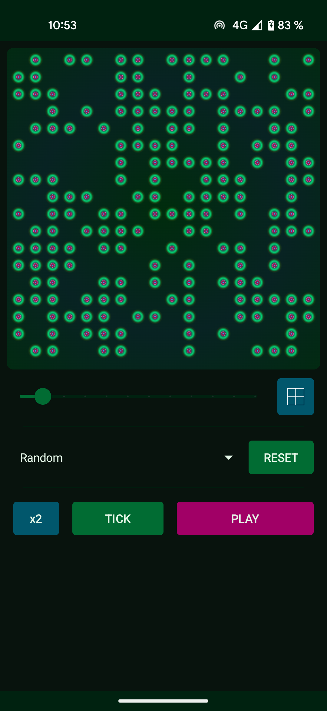

#  Game of Life

## App Description
- This app is an implementation of the zero player game name "Game of life" by John Conway's [https://en.wikipedia.org/wiki/Conway%27s_Game_of_Life](https://en.wikipedia.org/wiki/Conway%27s_Game_of_Life)

## Rules
At each step in time, the following transitions occur:

  - Any live cell with fewer than two live neighbours dies, as if by underpopulation.
  - Any live cell with two or three live neighbours lives on to the next generation.
  - Any live cell with more than three live neighbours dies, as if by overpopulation.

  - Any dead cell with exactly three live neighbours becomes a live cell, as if by reproduction.

## Setup
1. In your terminal : Clone this repo with :
```sh
git clone git@github.com:Illiouchine/GameOfLife.git
```
2. Open the project in Android Studio
3. Do a gradle sync
4. Now you should be able to build and deploy
5. Enjoy <3

## Used Libraries
- Ui Rendering with [compose](https://developer.android.com/jetpack/compose)
- Ui Design with [compose-material3](https://developer.android.com/jetpack/androidx/releases/compose-material3?hl=en)

## Thanks
- For the amazing design thanks to Kiouze : follow him on [https://twitter.com/KiouzeSama](https://twitter.com/KiouzeSama)

## View on PlayStore
[todo]()

## Screenshots


